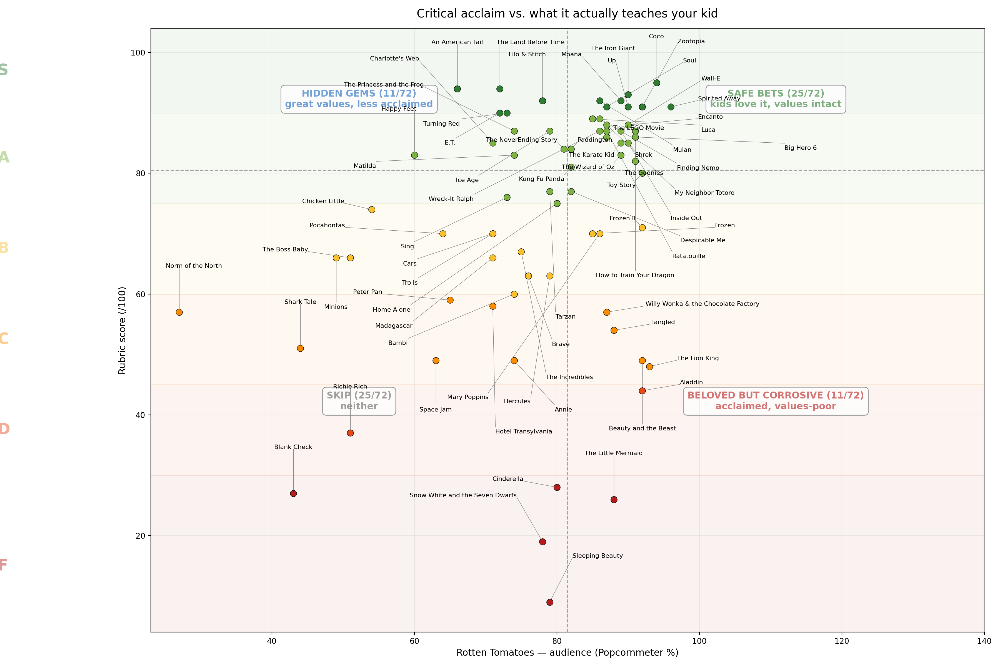

# Kidflix Rubric

**What children's movies actually teach, scored — and compared against critical acclaim,
audience love, box office, and adult cinema.**

Live at: **https://analysis.thebutygroup.com/kids-movies/**



---

## ⚠️ Read this first: subjectivity disclaimer

This is an **opinionated, values-based rubric, not an objective measure of film quality.**
Every dimension — especially the heavily weighted *Inherited Specialness & Wealth*
criterion — encodes a specific parenting concern: that stories teaching children
*"you matter because of what you were born as, and wealth/status is the reward for
goodness"* are a harmful paradigm to absorb young. Reasonable people disagree with
that premise, with the 40% weight it receives, and with individual film scores.

Concretely, this rubric will rank *The Land Before Time* far above *The Lion King*
and put *Cinderella* in F tier despite its craft and cultural stature. That is the
rubric working as designed, not a claim that these are bad films. Scores measure
**what a film's structure teaches**, from one parenting angle — nothing more.

The per-film scores were assigned through structured human judgment (film by film,
dimension by dimension, with written justifications) rather than any automated
process. The `commentary` column preserves the reasoning so every score can be
audited and contested. Contest them — that's the point of publishing the data.

---

## The rubric (100 points)

| # | Dimension | Weight | Question it asks |
|---|-----------|--------|------------------|
| 1 | **Inherited Specialness & Wealth** | 40 | Does the protagonist matter because of what they *do*, or what they were *born as/into*? Is wealth/status the endorsed reward — whether inherited (*The Lion King*) or climbed into (*Cinderella*, *Goodfellas*)? |
| 2 | **Protagonist Agency** | 17 | Do they solve their own story, or is rescue assembled around them? |
| 3 | **Emotional Core** | 17 | What is the story *about* underneath the plot — grief, identity, belonging (high) vs. status and validation (low)? |
| 4 | **Music** | 10 | Story-carrying original songs (10) · score-only/licensed (5) · grating (0). |
| 5 | **Inclusiveness & Anti-Prejudice** | 10 | Distinguishes *passive absence* from *active harm*: `10` inclusion is the lesson · `8–9` strong, secondary · `7` representation, not the lesson · `5–6` neutral · `4` homogeneous default / missed opportunity (the classic princess canon) · `2–3` harmful stereotyping or othering present in the text · `0–1` active degradation or othering as spectacle (*Wolf of Wall Street*, *Peter Pan*'s musical number). Every score carries a band-labelled justification in the `commentary` JSON. |
| 6 | **Romance Framing** | 6 | Absent/subverted (6) · balanced (3) · marriage-as-prize (0). |

**Key scoring bands for dimension 1** (the load-bearing criterion):
`40` genuinely ordinary protagonist (*Coco*, *Inside Out*) · `35` modest born-into
status (*Moana*, chief's daughter) · `30` status critiqued as hollow (*Encanto*) ·
`20` born-into greatness unexamined (*Cars*) · `16` royal-but-burdened (*Frozen*) ·
`0` status ascension as the reward, born or climbed (*Cinderella*, *Aladdin*,
*Scarface*). Note: **self-made ascension scores as low as inherited ascension** —
the rubric penalises the endorsed outcome (wealth as the prize), not the pursuit of a
livelihood (*The Princess and the Frog* scores 34).

**Tiers:** S ≥ 90 · A 75–89 · B 60–74 · C 45–59 · D 30–44 · F < 30.
Totals and tiers are always computed by `analysis.py`, never hand-entered.

## Datasets

Two deliberately separate files — segment reports never mix; only `compare_*`
outputs combine them:

- `data/movies.csv` — 72 kids/family films (G/PG)
- `data/movies_adult.csv` — 18 adult cult classics / influentials (R/PG-13)

### Data dictionary

| Column | Meaning |
|---|---|
| `title`, `year`, `mpaa` | Film, release year, MPAA rating |
| `wealth, agency, core, music, inclusion, romance` | Rubric dimension scores (max 40/17/17/10/10/6) |
| `rt_critic` | Rotten Tomatoes Tomatometer % (manual snapshot, July 2026) |
| `rt_audience` | RT Popcornmeter % (**approximate** — drifts over time; verify before publishing conclusions) |
| `revenue_musd` | Worldwide lifetime gross, nominal USD millions (approximate) |
| `revenue_adj_musd` | Inflation-adjusted to 2026 USD. Post-1980: CPI multiplier on release year. Pre-1980: published adjusted-gross estimates, because CPI-adjusting lifetime grosses that include decades of re-releases would badly overstate |
| `icon` | Optional path to a point icon (see icon note under Security) |
| `commentary` | JSON: `{"overall", "wealth", "agency", "core", "music", "inclusion", "romance"}` — the written justification per dimension. Source of truth: `scripts/commentary.py` |

RT has no public API and scraping violates their ToS; refresh scores via the
[OMDb API](https://www.omdbapi.com/) (free key, returns RT ratings). Keep the key
in an environment variable — never in the repo.

## Outputs (`python analysis.py`)

Per segment (kids unprefixed, adult as `adult_*`): scored CSV, critic and audience
scatters (quadrant-framed at dataset medians), a zoom on the safe-bet corner, a
rank-vs-rank view (pure ordinal relationship, Spearman ρ in the title), and a
critic-minus-audience divergence CSV.

Cross-segment (`compare_*` only): dimension-profile bar chart, combined rank view,
and the top-10-by-adjusted-revenue absolute scatter.

Interactive (`python interactive.py` → `output/interactive.html`): audience score vs
rubric, kids/adult filterable via legend, hover shows per-dimension scores plus
commentary, and **zoom-adaptive labels** (label budget grows as you zoom in,
highest-rubric films labelled first).

## Scoring via the Claude API (repeatable pipeline)

`scripts/score_movies_api.py` scores films against the rubric through the Claude
API instead of by hand, using the same `ANTHROPIC_API_KEY` env var as any other
Anthropic SDK project. **Every run is a bulk run by default**: requests are
submitted through the Message Batches API, which costs 50% of synchronous pricing
and completes within a 24-hour window (usually much faster) — the right trade for
a task that is never time-sensitive.

```bash
export ANTHROPIC_API_KEY=sk-ant-...

# submit a batch (default runs=3 per film) and poll until done:
python scripts/score_movies_api.py --file new_titles.txt --out data/movies.csv

# or submit and walk away, then collect later:
python scripts/score_movies_api.py --file new_titles.txt --no-wait
python scripts/score_movies_api.py --resume msgbatch_xxx --out data/movies.csv

# synchronous spot check (full price, immediate):
python scripts/score_movies_api.py "The Sandlot" --year 1993 --sync
```

Each submission writes a `batch_<id>.json` manifest (film list, model, prompt
hash) so results can be collected on any machine with the repo and the key.

Repeatability measures (and their honest limits):
- **`temperature=0`** — the most deterministic sampling setting. Anthropic's docs
  note that even at 0, outputs are *not fully deterministic* across calls, so:
- **`--runs N`** (default 3) scores each film N times and keeps the per-dimension **median**,
  reporting the max-min spread per dimension (0 everywhere = perfectly stable).
- **Pinned model**: set `KIDFLIX_MODEL` to a dated snapshot string rather than a
  floating alias; every result records the model used.
- **Prompt hashing**: the rubric prompt (which encodes every band with anchor
  scores from this repo's calibration) is SHA-hashed into each result, so any
  prompt drift between runs is detectable.
- **Model constraint**: `temperature` is rejected (HTTP 400) by Claude Opus 4.7+
  models — use Sonnet or Haiku for this pipeline.
- The model is instructed to refuse (`{"error": "insufficient knowledge"}`)
  rather than guess when it doesn't know a film.

API-scored rows land with empty `mpaa`/RT/revenue columns for manual fill, then
`analysis.py` recomputes totals and tiers as usual. Human-assigned and API-assigned
scores should not be silently mixed in published claims — note provenance.

## Reproducing this analysis from scratch

Someone starting from zero would follow these steps (this is the complete recipe):

1. **Define your values.** Decide what you don't want a film teaching your kid.
   Ours: wealth/status as reward, protagonists who matter by birth, passivity,
   marriage-as-prize. Decide what you *do* want: honest emotional cores, agency,
   inclusion, good music.
2. **Weight them.** Force the weights to sum to 100 and make the ranking argue with
   you — we started wealth at 50%, settled at 40% after pressure-testing against
   films we had intuitions about (Frozen ≈ B, Moana ≈ S).
3. **Write scoring bands** per dimension with anchor examples at each level, then
   **calibrate on 5 films** you know well before scoring at scale. Adjust bands, not
   individual scores, when something feels wrong.
4. **Score in bulk** with a one-line-per-dimension justification (the `commentary`
   JSON). Pressure-test edge cases: does self-made ascension score like inherited?
   (Ours: yes — see the Goodfellas/Cinderella equivalence.) Does allegory count for
   inclusion? (Ours: yes — Land Before Time.)
5. **Add external measures** — critic %, audience %, revenue (nominal + adjusted) —
   so the rubric can be *compared* against acclaim, love, and money rather than
   existing in a vacuum.
6. **Run the analysis**: `pip install -r requirements.txt && python analysis.py &&
   python interactive.py`. Read the off-diagonal quadrants: that's where the rubric
   adds information popularity can't.
7. **Publish data + reasoning together** so scores can be audited and disputed.

## Deployment

The site is fully static and lives in `docs/`, built by `python build_site.py`
(landing page, interactive chart with self-hosted `plotly.min.js`, all charts and
CSVs, and a `CNAME` file for the custom domain).

**GitHub Pages (recommended):** repo Settings → Pages → deploy from branch `main`,
folder `/docs`, then at your DNS provider add a `CNAME` record for
`analysis.thebutygroup.com` → `<username>.github.io`, and tick **Enforce HTTPS**
once the certificate issues. The chart is then at
`https://analysis.thebutygroup.com/kids-movies/`.

**PythonAnywhere alternative:** upload `docs/` and add a static-files mapping
(URL `/` → the docs directory) on a web app bound to the subdomain (custom domains
need a paid plan; add the CNAME they specify).

## Security & publication notes

- **Keep it static.** No forms, no server code, no cookies — the attack surface is
  essentially the hosting platform's.
- **Supply chain:** `plotly.min.js` is self-hosted and version-pinned rather than
  loaded from a CDN, so a CDN compromise can't inject script into the page. If you
  ever switch back to a CDN, add a Subresource Integrity (SRI) hash.
- **XSS:** the hover cards render the `commentary` JSON as HTML. Today that data is
  first-party and hand-written; if any external source (OMDb, scraped text, user
  submissions) ever flows into `commentary` or `title`, **HTML-escape it on ingest**
  — treat the CSVs as untrusted input to the build.
- **Secrets:** the repo contains none and must stay that way. The OMDb key for the
  refresh script belongs in an env var; `.env` is git-ignored. Check git *history*
  before publishing, not just the working tree.
- **Copyright:** do **not** commit or host movie posters/stills in `icons/` on the
  public site — poster art is copyrighted. Use original icons or leave dots. RT
  scores and revenue figures are facts, cited with attribution and marked
  approximate.
- **Defamation-adjacent caution:** the commentary criticises films, which is
  protected opinion; keep it about the *works*, not living individuals.
- **Subdomain hygiene:** if you ever decommission the Pages site, delete the DNS
  CNAME record too — a dangling CNAME pointing at `github.io` is a subdomain-takeover
  vector.
- **Privacy:** no analytics are included. If you add any, you're serving UK/EU
  visitors — mind consent requirements.

## Repo layout

```
data/movies.csv              kids dataset (source of truth)
data/movies_adult.csv        adult dataset (separate, never mixed into kids reports)
scripts/commentary.py        editable per-dimension commentary -> JSON at build
analysis.py                  scoring, tiers, all static charts, divergence
interactive.py               zoom-adaptive Plotly page
build_site.py                assembles docs/ for deployment
docs/                        deployable static site (GitHub Pages)
output/                      generated artifacts
```

## License & attribution

Scores and commentary are original opinion, released as-is. Rotten Tomatoes scores
© Fandango, quoted as factual data points. Revenue figures approximate, various
public sources. No affiliation with any studio.
